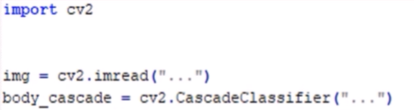
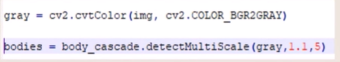
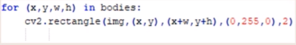

# HAAR CASCADE 

Haar Cascade, nesne tanıma ve algılama için kullanılan bir makine öğrenimi tekniğidir. Özellikle yüz tanıma gibi alanlarda sıkça kullanılır. Haar Cascade, önceden tanımlanmış özelliklere dayalı olarak nesneleri algılamak için bir tür öğrenme algoritmasıdır.

[Haar Casda İndirme Bağlantısı](https://github.com/opencv/opencv/tree/master/data/haarcascades)

Haar Cascade'ler xml uzantılı dosyalardır.

Haar Cascade Algoritması:

- İlgili kütüphaneyi, görüntüyü ve haar cascade dosyasını dahil et.

- Görüntüyü boz(gri) tonlara çevirerek üzerinde ilgili nesneyi ara.

- Bulunan nesneyi işaretle. 

- Bulunan nesneyi işaretle.

